# HADL

**H**uman-**AI** **D**esign **L**anguage — a programming language for AI to write
software in.

Not an IDE. Not an agent. A language — with its own syntax, its own type system,
its own compiler, and its own opinions about what good software looks like.

[](https://github.com/dscanavall11/hadl/actions/workflows/ci.yml)
[](https://www.npmjs.com/package/@haic/cli)
[](LICENSE)



```bash
npm install -g @haic/cli && haic new my-store
```

```
## aggregate Order
identified by id
contains OrderItem
emits OrderPlaced

- id: uuid, required
- items: list of OrderItem, required
- status: OrderStatus, required, default Draft
- total: Money, derived

invariant "an order must hold at least one item":
  items is not empty

operation compute total () -> Money:
  return Money with amount = sum of items by quantity times unitPrice.amount, currency = "EUR"
```

That is the source. It compiles to Java, TypeScript, Python or Go, and to the
Docker, Kubernetes, Terraform or AWS artifacts needed to run it. A Rust backend
exists but does not compile yet; the [status](#status) section says why.

---

## Why

An AI asked to build a service in Java will write a service in Java. It will also
write four interfaces with one implementation each, a DTO that mirrors the entity
field for field, a service layer that forwards every call unchanged, and an error
hierarchy nobody throws. Every piece of it is defensible in isolation. Together
they are a codebase nobody asked for.

The problem is not that the model writes bad Java. It is that Java — and
TypeScript, and Python — will happily accept all of it. The language has no
opinion, so the only thing holding the design together is taste, and taste does
not survive a large enough prompt.

HADL has opinions, and the compiler enforces them:

```
warning[HADL2503]: PlaceOrderService.fetch order only forwards "find order by id"
  --> src/orders.hadl:88:3
  help: let the caller use the port directly, or add the rule this operation was meant to hold

warning[HADL2502]: dto OrderDto has exactly the same fields as aggregate Order
  --> src/orders.hadl:41:1
  help: a dto exists to carry less than the model; either drop fields or reuse Order

error[HADL2207]: aggregate Order embeds aggregate Customer in field "customer"
  --> src/orders.hadl:52:3
  help: store the identity instead: "- customerId: uuid, required"
```

Run `haic explain HADL2503` for the reasoning behind any of them.

---

## What it checks

| Family | What it enforces |
| --- | --- |
| **Types** | Full inference over operation bodies; no null, no implicit any |
| **DDD** | Aggregate boundaries, entity ownership, value-object purity, no I/O in the domain |
| **Errors** | Checked errors are declared, reachable, and mapped to a status at every endpoint |
| **Architecture** | Services depend on ports not adapters; every outbound port has an adapter; interface segregation; single responsibility |
| **Simplicity** | Unreachable declarations, duplicate shapes, pass-through operations, ports with no callers, fields nothing reads |

The first four are errors. The last family is warnings and notes — unused code is
a smell, not a contradiction. `haic check --strict` promotes them.

---

## Getting started

```bash
npm install -g @haic/cli
```

The command is `haic`:

```bash
haic new my-store
```

That writes a complete slice — one aggregate with a real invariant, a port, a
service, an endpoint and two scenarios — which compiles as written:

```bash
cd my-store
haic check src     # parse, type-check and audit the design
haic test src      # run the scenarios, ~1s, nothing generated
haic build src --target typescript --out out
```

Without installing, `npx @haic/cli new my-store` does the same thing.

Then generate the service and run it:

```bash
haic build src --target typescript --out out
cd out/typescript && npm install && npm run dev
```

```
listening on http://localhost:8080
```

It serves for real, against an in-memory store. The worked CRUD example — which
lives in the repository, not in the installed package — answers like this:

```bash
curl -X POST localhost:8080/tasks -H 'content-type: application/json' \
  -d '{"title":"Buy milk","notes":null,"dueOn":null}'
# → 201 {"id":"74afa342-…","title":"Buy milk","state":"Open",…}

curl -X POST localhost:8080/tasks -H 'content-type: application/json' \
  -d '{"title":"","notes":null,"dueOn":null}'
# → 422 {"code":"CONSTRAINT_VIOLATION","message":"Task.title violates min length 1"}
```

That 422 came from one modifier in the source:
`- title: text, required, min length 1, max length 200`.

Generating is the last step, not the first. Before it, run the design:

```bash
haic test src
```

```
tasks
  ✓ creating a task
  ✓ reading one that is not there
  ✓ a title must not be empty
  ✓ updating changes the title

7 passed
```

That runs the operations against the IR itself — no code generated, no toolchain,
no tokens. A scenario the interpreter cannot execute is reported as **could not
run**, never as a pass.

**→ [Build your own CRUD](docs/crud-tutorial.md)** — the whole path, step by step.

---

## When the design is not the whole story

Some logic is not a design decision. A price-time matching loop, a great-circle
distance, a sum that has to be exact in cents — each has one correct form, and
restating it in design vocabulary produces a translation nobody can check
against the original.

So an operation body can be the fence Markdown already has:

````
operation match incoming (side: Side, limitPrice: decimal, quantity: integer, orderId: uuid) -> list of Trade:
  ```typescript
  const resting = side === Side.Buy ? this.asks : this.bids;
  resting.sort((a, b) => (a.limitPrice === b.limitPrice ? +a.placedAt - +b.placedAt : a.limitPrice - b.limitPrice));
  ...
  ```
````

That code is copied into the generated project unchanged. Everything around it
stays the compiler's: the signature, the checked errors, the invariant that says
a book never crosses itself, the service that loads and saves, the endpoint, the
status codes.

Write statements beside the block and they become the reference implementation —
`haic test` runs those, the block is what ships. Write no statements and the
compiler says so:

```
warning[HADL2602]: no scenario can exercise OrderBook.match incoming: its only body is typescript
```

Blocks can name more than one language, and `--language` decides which backend
runs, whatever the source declared:

```bash
haic build src --language js       # the ```typescript block
haic build src --language python   # the ```python block
haic build src --language go       # error[HADL3060]: no body for go
```

Three systems in [`examples/`](examples) are built around this: an order book, a
double-entry ledger, and courier dispatch. None of them is CRUD.

---

## Why write this instead of prompting for the code

The tasks example is **144 lines** of `.hadl`. It produces **411 lines of
TypeScript** across 13 files, or **515 lines of Java** across 20 — before tests,
build files, or the compose stack that come with them.

You iterate on the 144 lines: small enough to hold in your head, and a mistake
there is a compiler error with a line number rather than a plausible-looking
paragraph. Only then do you spend the tokens to expand it. And the expansion is
deterministic — same source, same output, every time — so re-running it costs
nothing and reviewing it is a diff, not a re-read.

---

## Commands

| Command | Does |
| --- | --- |
| `haic new <name>` | Scaffold a project |
| `haic check [paths]` | Parse, type-check and audit the design |
| `haic test [paths]` | Run the declared scenarios against the IR — no code generated, no tokens spent |
| `haic build [paths] --language <lang>` | Generate the service, in the language you name |
| `haic deploy [paths] --target <platform>` | Generate the infrastructure |
| `haic architect <requirements.md>` | Turn a requirements document into a reviewable spec and draft sources |
| `haic ir [paths]` | Print the typed IR as JSON |
| `haic explain <code>` | Explain the reasoning behind a diagnostic |
| `haic targets` | List available targets |

---

## Handing it to an AI

[`AGENTS.md`](AGENTS.md) is the whole language in one file, written to be read by
a model rather than a person: syntax, the rules that decide reviews, the mistakes
worth naming, and the check-test-build loop it should drive itself with.

Cursor, Claude Code, Codex, Copilot and Antigravity read it from the repository
root without being asked. For anything else — a chat window, your own agent —
paste it. It is about 2,000 tokens and complete on its own.

[`llms.txt`](llms.txt) indexes the rest for tools that follow that convention.

The loop is what makes this work. `haic check` reports exact spans and stable
codes, `haic explain <code>` explains any of them, and `haic test` runs the
declared scenarios in about a second without generating anything. A model can
correct itself against a real compiler instead of guessing — which is the
difference between a language an AI can use and a prompt it can only follow.

---

## Editor support

A Visual Studio Code extension lives in [`editors/vscode`](editors/vscode):
highlighting, two-space indentation with guides, folding, and snippets for every
declaration. It is not on the Marketplace yet — copy the folder into your
extensions directory, or package it:

```bash
npx @vscode/vsce package
```

HADL has almost no punctuation, so colour carries more of the load than in a
curly-brace language: it is what separates a declaration from the prose beside
it. The grammar uses standard TextMate scopes, so whatever theme you already run
will colour it without knowing the language exists.

No language server yet. The compiler already produces diagnostics with exact
source spans, so that is the obvious next step — see
[`editors/vscode/README.md`](editors/vscode/README.md).

---

## How it fits together

```
 .hadl sources
      │
      ▼
   parser ──────────► AST            hand-written, line-oriented, no build step
      │
      ▼
  analyzer ─────────► diagnostics    seven passes: symbols, architecture, types,
      │                              error flow, DDD, simplicity, native bodies
      ▼
  typed IR (JSON)                    the single source of truth, diffable and reviewable
      │
      ├──► code generators ────────► Java · TypeScript · Python · Go · Rust
      └──► infrastructure ─────────► Docker · Kubernetes · Terraform · AWS
```

One IR, N backends — never source-to-source. Adding a language means registering
one more `CodeGenerator`; nothing existing changes.

Compilation is **deterministic**: no LLM calls, no network, no randomness. The
same source produces the same bytes. The AI Architect, which turns a requirements
document into a first draft, is a separate phase that runs before compilation and
writes a reviewable `.ai-spec/` directory rather than code.

---

## Repository layout

| Package | Holds |
| --- | --- |
| `packages/core` | IR schema, diagnostics, naming, emission primitives, registries |
| `packages/parser` | Lexer, expression and statement parsers, declaration parsers |
| `packages/analyzer` | The seven semantic passes and the type checker |
| `packages/codegen` | One backend per target language |
| `packages/iac` | One generator per deployment platform |
| `packages/architect` | Requirements → bounded contexts → domain model → draft sources |
| `packages/cli` | The `haic` command |
| `editors/vscode` | Grammar, indentation and snippets for Visual Studio Code |

- [CRUD tutorial](docs/crud-tutorial.md)
- [Branching](docs/branching.md)
- [Language reference](docs/language-reference.md)
- [Worked example](examples/orders/orders.hadl)

---

## Status

Working end to end, and early.

Eight worked example modules compile to every backend and all four platforms, and
the compiler itself has 310 tests.

Whether the emitted project then satisfies its own toolchain is a separate
question, so CI builds every one of them with the real compiler on every push:

| Target | Command | Result |
| --- | --- | --- |
| TypeScript | `tsc --noEmit` | passes |
| Java | `mvn compile` | passes |
| Python | `python -m compileall` | passes |
| Go | `go build ./...` | passes |
| Rust | `cargo check` | **experimental — does not compile** |

Rust is the honest exception. The emitter treats ownership as if it were not
there: it moves a value and then reads it, and writes `&mut self` methods that
move out of their own fields. Fixing it means teaching the backend to borrow,
which is real work and not yet done. It runs in CI as an allowed failure so the
gap stays measured rather than forgotten. **Do not pick Rust for anything real
yet.** The other four are built and verified on every commit.

Known gaps, in the order they matter:

- No `flat map`. `each of` and `only … where` cover map and filter; a projection
  that returns a list per element still has to be written as a loop.
- A list literal cannot hold constructions. `lines = [Line with id = "a", Line
  with id = "b"]` cannot be told apart from one construction with four
  arguments; bind them first and write `lines = [first, second]`.
- The architect's field-naming heuristic produces awkward names from long
  requirement sentences. It flags them as open questions rather than hiding them.
- Adapters generate real queries only for the four repository phrases they
  recognise. Everything else is left, explicitly, to the author.
- No language server, so no diagnostics in the editor.

## Licence

Apache-2.0.
